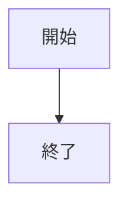

# 検索・履歴・エクスポートなどを使う

## 文書内検索

左端の検索ボタンか `Ctrl+F` で、現在の文書にあるMarkdownページをまとめて検索できます。

検索結果にはページ名・行番号・該当行が表示されます。結果を選ぶと、そのページへ移動します。

## Command Palette

`Ctrl+Shift+P` でCommand Paletteを開きます。

新規作成、開く、保存、検索、表示切替、ページ操作、Formatter、Lint、エクスポートなどを名前で探して実行できます。

## マクロ

左端の「マクロ」から、Commandを並べた簡単なマクロを作れます。

1. マクロ名を入力して「記録開始」を押します。
2. Command Palette、ボタン、ショートカットから操作します。
3. 「記録停止して保存」を押します。
4. 保存したマクロの「実行」で、同じCommand列を順番に実行します。

文字入力そのものは記録しません。HatoNoteのCommandとして登録された操作だけを記録します。

## テンプレート

通常MDZの「ページ追加」では、空ページ・メモ・議事録・仕様書のテンプレートを選べます。

新規作成画面からも、通常MDZを文書テンプレートから作成できます。

## ページを複製する

通常MDZでは、編集モードの「ページ複製」で現在ページをコピーできます。

複製ページは元ページの直後へ追加され、同名にならないファイル名が自動で付きます。

スライドはサムネイルの右クリックメニューから複製できます。

## 最近開いた文書

何も開いていない開始画面には、最近開いた文書が最大10件表示されます。

項目を選ぶと、そのウィンドウで文書を開きます。

## Formatter

編集モードの「整形」で現在のMarkdownを整形できます。

設定から次の規則を変更できます。

- コードフェンス外の行末空白を削除するか
- 連続空行を何行まで残すか
- ファイル末尾へ改行を付けるか

コードフェンス内の本文は変更しません。整形結果はUndoできます。

## Lint

編集モードの「Lint」で現在ページを検査できます。

設定から次の規則を変更できます。

- 行末空白
- 長すぎる行
- 最大行長
- 見出しレベルの飛び
- ファイル末尾改行

Lintは本文を書き換えません。

## バックアップ履歴と名前付き世代

保存済み文書では、左端の履歴ボタンからバックアップ履歴を確認できます。

自動バックアップとは別に、任意の名前を付けた世代も保存できます。

履歴では次の操作ができます。

- 作成日時と容量を確認する
- 現在状態とのMarkdownページ差分を見る
- 過去の状態を現在の作業状態へ復元する

履歴から復元しただけでは保存済みファイルを上書きしません。内容を確認してから通常の「保存」を行ってください。

## エクスポート

左端のエクスポートボタンから、現在の未保存内容を別ファイルへ出力できます。

- 単一HTML: 文書内画像を埋め込んだ1ファイルのHTML
- PDF: Microsoft EdgeのヘッドレスPDF出力を利用

エクスポートしても、通常の保存先や未保存状態は変わりません。

## Mermaid

`mermaid` コードフェンスを図として表示できます。



設定でMermaid CLIの `mmdc` を指定します。空欄ではPATHから探します。

導入後はコマンドプロンプトなどで `mmdc --version` が実行できる状態にするか、設定画面で `mmdc.cmd` または実行ファイルを直接指定してください。

Mermaid CLIが無い場合は、元のコードブロックを表示します。

## PlantUML

`plantuml` または `puml` コードフェンスをPlantUML図として表示できます。

```plantuml
Alice -> Bob: Hello
```

設定でJavaと `plantuml.jar` を指定します。Javaは空欄ならPATH上の `java` を使用できます。PlantUML JARはダウンロードした `plantuml.jar` の場所を指定してください。

導入確認では `java -version` が実行できることと、指定した `plantuml.jar` が存在することを確認します。PlantUMLはSANDBOXセキュリティプロファイルで実行します。

## 数式

KaTeX CLIを使うと、次の書き方をMathMLとして表示できます。

```math
c = \sqrt{a^2 + b^2}
```

単独の段落では次の書き方も使えます。

```text
$$
c = \sqrt{a^2 + b^2}
$$
```

設定でKaTeX CLIを指定します。空欄ではPATHから `katex` を探します。導入後は `katex --help` が実行できる状態にするか、設定画面で実行ファイルまたはコマンドファイルを指定してください。

HatoNoteではKaTeXのMathML出力を使用するため、外部CSSやWebフォントへの接続は必要ありません。

インラインの `$...# 検索・履歴・エクスポートなどを使う

## 文書内検索

左端の検索ボタンか `Ctrl+F` で、現在の文書にあるMarkdownページをまとめて検索できます。

検索結果にはページ名・行番号・該当行が表示されます。結果を選ぶと、そのページへ移動します。

## Command Palette

`Ctrl+Shift+P` でCommand Paletteを開きます。

新規作成、開く、保存、検索、表示切替、ページ操作、Formatter、Lint、エクスポートなどを名前で探して実行できます。

## マクロ

左端の「マクロ」から、Commandを並べた簡単なマクロを作れます。

1. マクロ名を入力して「記録開始」を押します。
2. Command Palette、ボタン、ショートカットから操作します。
3. 「記録停止して保存」を押します。
4. 保存したマクロの「実行」で、同じCommand列を順番に実行します。

文字入力そのものは記録しません。HatoNoteのCommandとして登録された操作だけを記録します。

## テンプレート

通常MDZの「ページ追加」では、空ページ・メモ・議事録・仕様書のテンプレートを選べます。

新規作成画面からも、通常MDZを文書テンプレートから作成できます。

## ページを複製する

通常MDZでは、編集モードの「ページ複製」で現在ページをコピーできます。

複製ページは元ページの直後へ追加され、同名にならないファイル名が自動で付きます。

スライドはサムネイルの右クリックメニューから複製できます。

## 最近開いた文書

何も開いていない開始画面には、最近開いた文書が最大10件表示されます。

項目を選ぶと、そのウィンドウで文書を開きます。

## Formatter

編集モードの「整形」で現在のMarkdownを整形できます。

設定から次の規則を変更できます。

- コードフェンス外の行末空白を削除するか
- 連続空行を何行まで残すか
- ファイル末尾へ改行を付けるか

コードフェンス内の本文は変更しません。整形結果はUndoできます。

## Lint

編集モードの「Lint」で現在ページを検査できます。

設定から次の規則を変更できます。

- 行末空白
- 長すぎる行
- 最大行長
- 見出しレベルの飛び
- ファイル末尾改行

Lintは本文を書き換えません。

## バックアップ履歴と名前付き世代

保存済み文書では、左端の履歴ボタンからバックアップ履歴を確認できます。

自動バックアップとは別に、任意の名前を付けた世代も保存できます。

履歴では次の操作ができます。

- 作成日時と容量を確認する
- 現在状態とのMarkdownページ差分を見る
- 過去の状態を現在の作業状態へ復元する

履歴から復元しただけでは保存済みファイルを上書きしません。内容を確認してから通常の「保存」を行ってください。

## エクスポート

左端のエクスポートボタンから、現在の未保存内容を別ファイルへ出力できます。

- 単一HTML: 文書内画像を埋め込んだ1ファイルのHTML
- PDF: Microsoft EdgeのヘッドレスPDF出力を利用

エクスポートしても、通常の保存先や未保存状態は変わりません。

## Mermaid

`mermaid` コードフェンスを図として表示できます。


設定でMermaid CLIの `mmdc` を指定します。空欄ではPATHから探します。

導入後はコマンドプロンプトなどで `mmdc --version` が実行できる状態にするか、設定画面で `mmdc.cmd` または実行ファイルを直接指定してください。

Mermaid CLIが無い場合は、元のコードブロックを表示します。

## PlantUML

`plantuml` または `puml` コードフェンスをPlantUML図として表示できます。

```plantuml
Alice -> Bob: Hello
```

設定でJavaと `plantuml.jar` を指定します。Javaは空欄ならPATH上の `java` を使用できます。PlantUML JARはダウンロードした `plantuml.jar` の場所を指定してください。

導入確認では `java -version` が実行できることと、指定した `plantuml.jar` が存在することを確認します。PlantUMLはSANDBOXセキュリティプロファイルで実行します。

## 数式

KaTeX CLIを使うと、次の書き方をMathMLとして表示できます。

```math
c = \sqrt{a^2 + b^2}
```

単独の段落では次の書き方も使えます。

```text
$$
c = \sqrt{a^2 + b^2}
$$
```

 は、金額などの文字列との誤判定を避けるため自動変換しません。

Mermaid、PlantUML、数式は通常プレビュー、スライド、単一HTML、PDFで利用できます。
